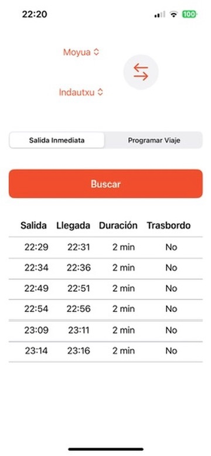
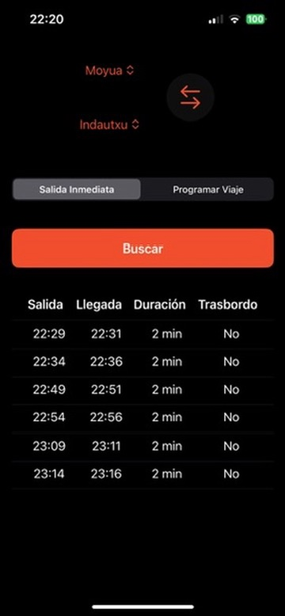

# 🚇 Metro Bilbao Widget

Widget para iOS que muestra los próximos trenes entre dos estaciones del Metro de Bilbao. Desarrollado en SwiftUI con integración de WidgetKit y App Intents.

---

## 📲 Funcionalidades

- Selección de estación de origen y destino  
- Modo de salida inmediata o programada  
- Consulta de horarios en tiempo real  
- Compatibilidad con modo oscuro  
- Widget personalizable desde la pantalla de inicio

---

## 🛠️ Tecnologías

- SwiftUI  
- WidgetKit  
- App Intents  
- URLSession + JSON  
- Xcode 16  
- iOS 17+

---

## 📷 Capturas de pantalla

| Modo Claro | Modo Oscuro |
|------------|-------------|
|  |  |

---

## ⚙️ Instalación

1. Clona el repositorio:
   ```bash
   git clone https://github.com/Aimarpr12/MetroBilbao
   ```
2. Abre el proyecto en Xcode.
3. Configura el equipo en `Signing & Capabilities`.
4. Selecciona un dispositivo físico y ejecuta con ⌘R.

> ⚠️ **Nota:** La extensión del widget requiere ejecución en dispositivo real.

---

## 🧪 Estado del desarrollo

- [x] Selección de estaciones  
- [x] Visualización de horarios  
- [x] Soporte para WidgetKit  
- [ ] Notificaciones personalizadas  
- [ ] Traducción a euskera  

---

## 📄 Licencia

MIT License  
© [Aimar Pelea](https://github.com/Aimarpr12)

---

### 🗂️ Fuente de datos

MetroApp no descarga un paquete GTFS estático: consume directamente los
end-points oficiales de Metro Bilbao para mostrar datos en tiempo real
y planificados.

| End-point | Ejemplo de URL | Qué devuelve | Uso dentro de la app |
|-----------|----------------|--------------|----------------------|
| **Real-time** | `https://api.metrobilbao.eus/metro/real-time/<origen>/<destino>` | Próximos trenes entre dos estaciones (horarios en < 10 min). | Vista “Salida inmediata” y Widget “Próximos Trenes”. |
| **Planificado** | `https://api.metrobilbao.eus/metro/obtain-schedule-of-trip/<origen>/<destino>/<hh.mm_desde>/<hh.mm_hasta>/<dd-MM-yyyy>/es` | Horario oficial para cualquier franja y fecha. | Vista “Programar viaje”. |
| **Teleindicador** | `https://api.metrobilbao.eus/api/stations/<estación>?lang=es` | Mismo texto que aparece en los paneles del andén (destino, minutos y hora). | Vista “Teleindicador” para una estación concreta. |

> **Nota:** Todas las peticiones usan HTTPS y se procesan mediante `URLSession` con
> codificación JSON. No se almacena información personal ni se guarda caché
> persistente: la app siempre muestra la información más reciente que
> devuelve el operador.
